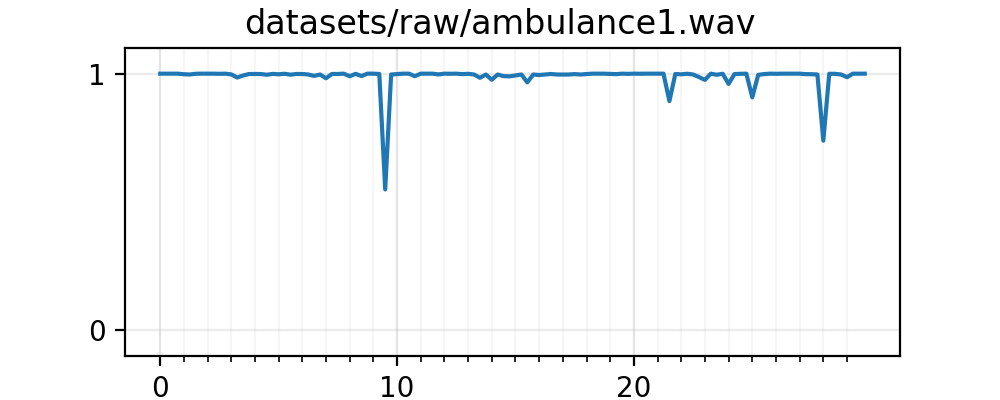
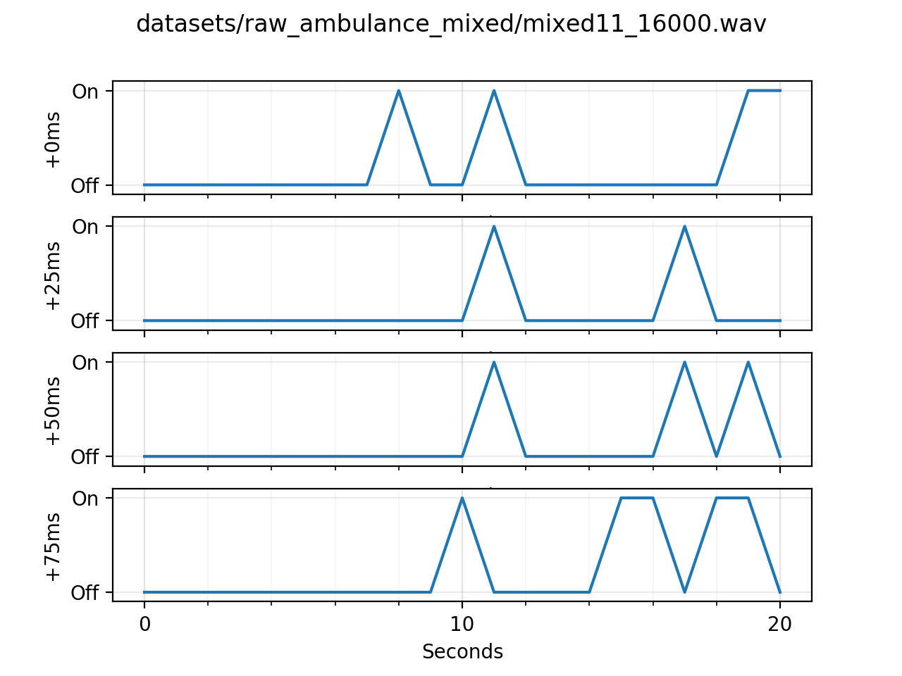
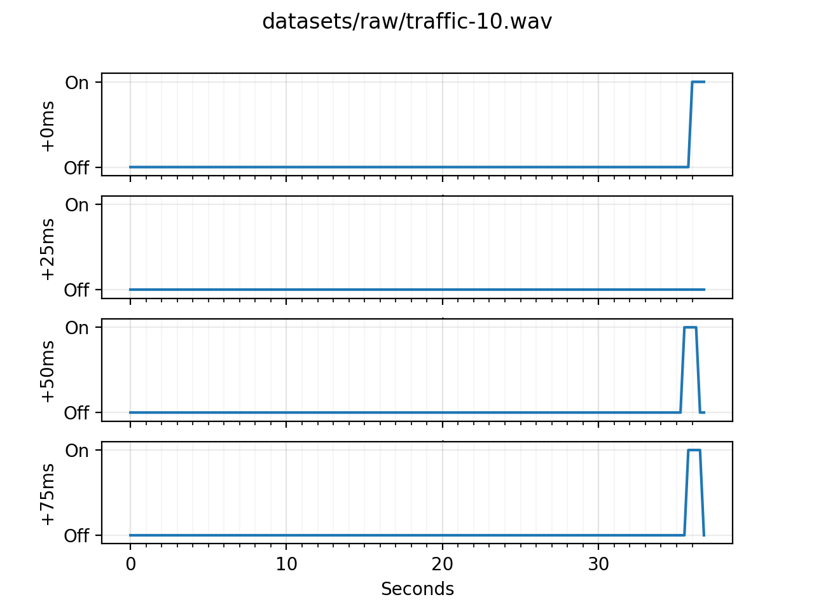
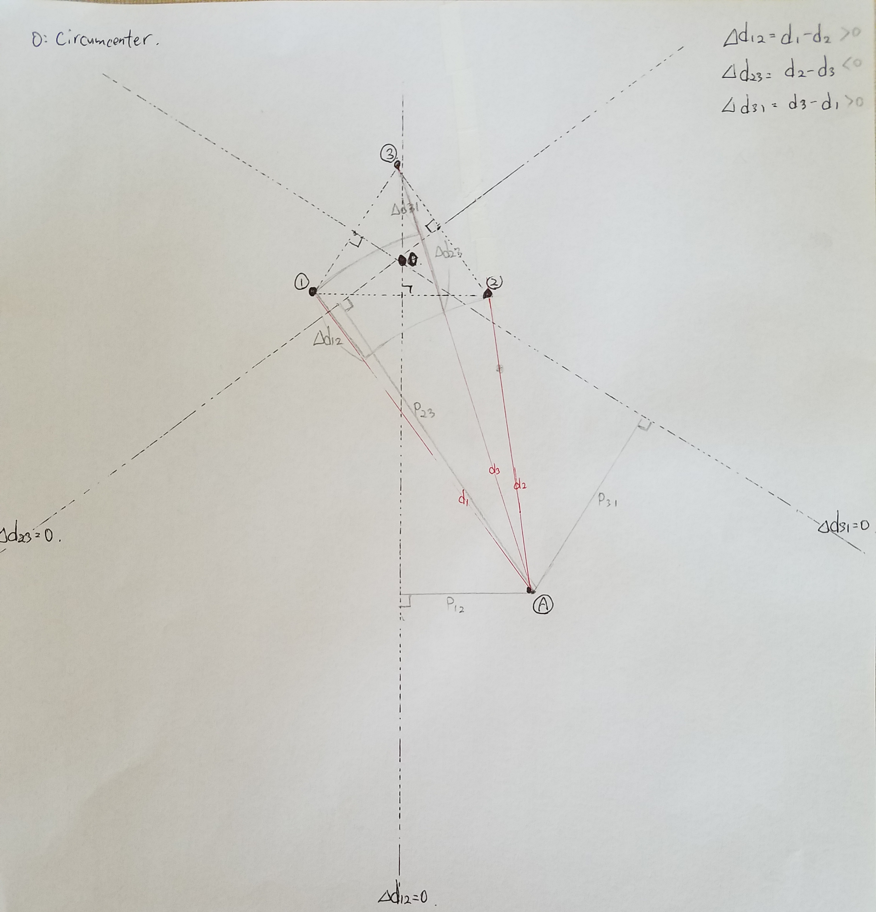
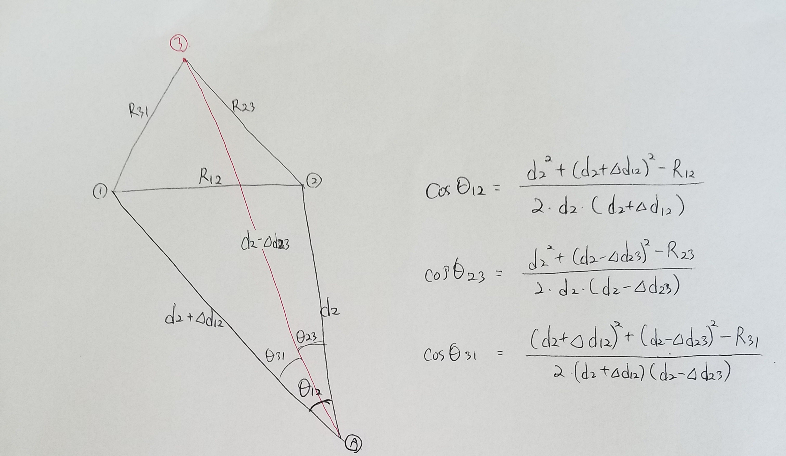
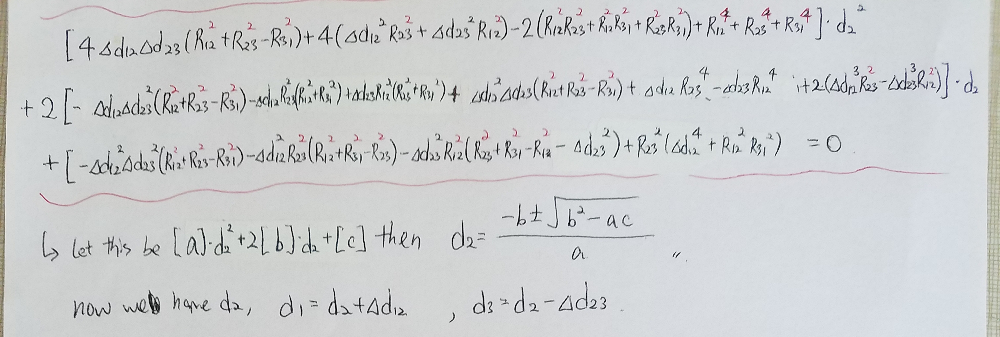
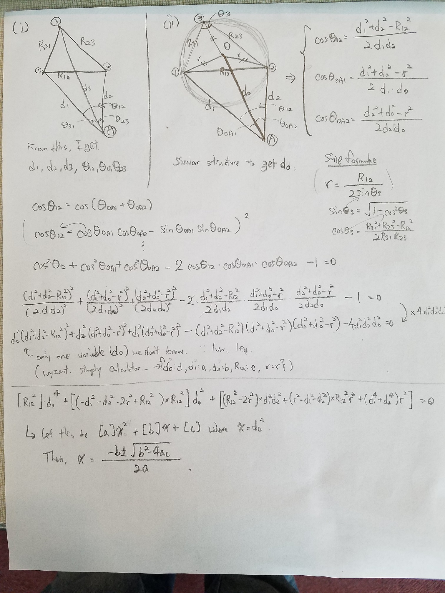
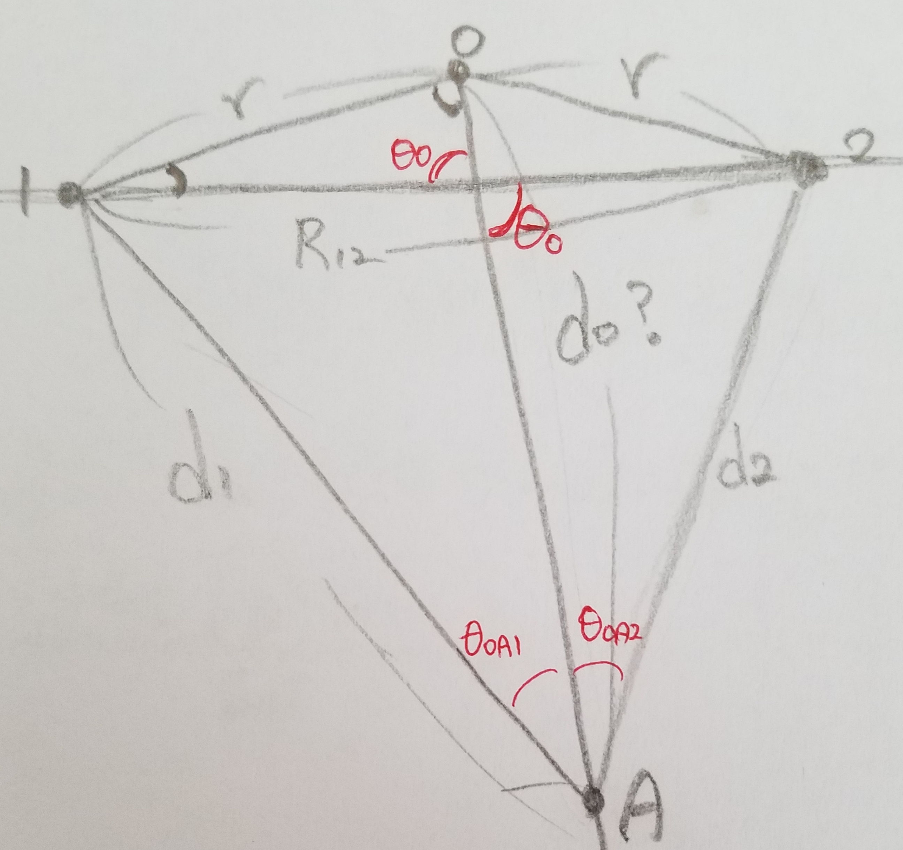

# Identification and Localization of Siren Signals with Beamforming and Non-negative Matrix Factorization

## Team members
- Hankyu Jang (hankjang@iu.edu)
- Leonard Yulianus (lyulianu@iu.edu)
- Sunwoo Kim (kimsunw@iu.edu)

# Part1: Ambulance Identification
## Datasets
### Preprocessing
Convert audio signal to 16kHz sampling rate and 1 audio channel:
```bash
sox --norm <input> -b 16 <output> rate 16000 channels 1 dither -s
```

## Experiment
### Prerequisite
Since the code are written in Python 3, if you run the code on the campus servers, turn Python 3 module on by running:
```bash
module load python/3.6.0
```

### Dimensionality Reduction Model
First, we need to train a dimensionality reduction model (NMF), run the following command to train the model:
```bash
python train-dimred.py <model output> <audio training input>
```

For example, we are building the model using our training ambulance signals:
```bash
python train-dimred.py ambulance.dimred datasets/train/ambulance/*.wav
```

### Classifier (Naive Bayes)
We train the classifier using the lower dimensional data that will be transformed by our dimensionality reduction model, run the following command:
```bash
python train-nb.py <classifier model output> <audio training input> --dimred <dimensionality reduction model>
```

#### Without Dimensionality reduction
```bash
python train-nb.py naive_bayes.model datasets/train/**/*.wav
```

#### With Dimensionality reduction
```bash
python train-nb.py naive_bayes.model datasets/train/**/*.wav --dimred ambulance.dimred
```

### Testing
Now we can use the classifier model to test our test set:
```bash
python test.py naive_bayes.model datasets/test/**/*.wav
```

### Result
Without dimensionality reduction:
```bash
$ python train-nb.py naive_bayes.model datasets/train/{ambulance,others}/*.wav
Training accuracy: 0.9527027027027027
$ python test.py naive_bayes.model datasets/test/{ambulance,others}/*.wav
Testing accuracy: 0.95
```

With dimensionality reduction:
```bash
$ python train-dimred.py ambulance.dimred datasets/train/ambulance/*.wav
$ python train-nb.py naive_bayes.model datasets/train/{ambulance,others}/*.wav --dimred ambulance.dimred
Training accuracy: 0.9746621621621622
$ python test.py naive_bayes.model datasets/test/{ambulance,others}/*.wav
Testing accuracy: 0.96
```

### Result (on mixed ambulance data)
Without dimensionality reduction:
```bash
$ python train-nb.py naive_bayes.model datasets/train/{ambulance,others}/*.wav
Training accuracy: 0.9527027027027027
$ python test.py naive_bayes.model datasets/test/mixed_ambulance/**/*.wav
Testing accuracy: 0.845
```

With dimensionality reduction:
```bash
$ python train-dimred.py ambulance.dimred datasets/train/ambulance/*.wav
$ python train-nb.py naive_bayes.model datasets/train/{ambulance,others}/*.wav --dimred ambulance.dimred
Training accuracy: 0.9746621621621622
$ python test.py naive_bayes.model datasets/test/mixed_ambulance/**/*.wav
Testing accuracy: 0.89
```

## Visualizing audio signals
We can run the detection against longer audio signals, and see the detection per seconds by running:
```bash
python viz-audio.py <classifier model> <audio signal(s)>
```

For example (show graph to the screen):
```bash
python viz-audio.py naive_bayes.model datasets/{raw/ambulance1.wav,raw/traffic-10.wav,raw_ambulance_mixed/mixed11_16000.wav}
```

For example (save graph to file, useful when running from server):
```bash
python viz-audio.py naive_bayes.model datasets/{raw/ambulance1.wav,raw/traffic-10.wav,raw_ambulance_mixed/mixed11_16000.wav} --save
```

### Some plot results




# Part2: Localization

Here, we are going to find the location of the ambulance by using the recording data captured from three microphones.

## Mathematic proof of the model

Following diagram shows the overall structure of the problem we are solving. 

- $\textcircled{1}$: microphone1
- $\textcircled{2}$: microphone2
- $\textcircled{3}$: microphone3
- $\textcircled{A}$: ambulance
- $d_1$: distance from (A) to (1)
- $d_2$: distance from (A) to (2)
- $d_3$: distance from (A) to (3)
- $\Delta d_{12}$: $d_1$ - $d_2$
- $\Delta d_{23}$: $d_2$ - $d_3$
- $\Delta d_{31}$: $d_3$ - $d_1$

The three imaginary lines are drawn that equally perpendicularly divides the sides. If the ambulance is on the line where $\Delta d_{12}$=0, then this means Ambulance is within same distance from (1) and (2). If $\Delta d_{12}$ > 0, the ambulance is located on the right hand side. We used this knowledge to calculate the three distances.



- R12: distance between (1) and (2)
- R23: distance between (2) and (3)
- R31: distance between (3) and (1)
- $\theta_{12}$: Angle 1A2
- $\theta_{23}$: Angle 2A3
- $\theta_{31}$: Angle 3A1





Using the three distances each from microphone to the source, I calculated the distance from the circumcenter to the source. Let's call this distance d0 (length of OA in the following diagram).



After getting the d0, I calculated the angle from the circumcenter to the source (I set the line 12 as the base line). Let's say this angle as theta0.



To calculate theta0, I used two triangles, 012 and 10A to get the angles theta012 and theta10A. At last I got theta0 by subtracting those two angles from 180.

## Implementation of the model

input: 
- d12: distance difference of the signal 1 and 2
- d31: distance difference of the signal 3 and 1
- R12: distance between microphone1 and microphone2
- R23: distance between microphone2 and microphone3
- R31: distance between microphone3 and microphone1

output:
- d0: distance from the circumcenter of the three microphone and the source
- theta0: angle from the circumcenter of the three microphone and the source

```bash
$ python -i localization.py -d12 5.0 -d31 4.0 -R12 10.0 -R23 9.7 -R31 10.2
d0: 9.039, theta0: 64.145degrees
```

## (Next Step) Record ambulance signal using three microphones 

- Using equilateral triangle(doesn't have to be equilateral) to place the microphones with distance of around 80 cm btw each point
    - one beep that indicate the start signal
    - static with beep(instead of ambulance signal)
    - move the beep sound in x-axis, y-axis, try different movements
    -  


