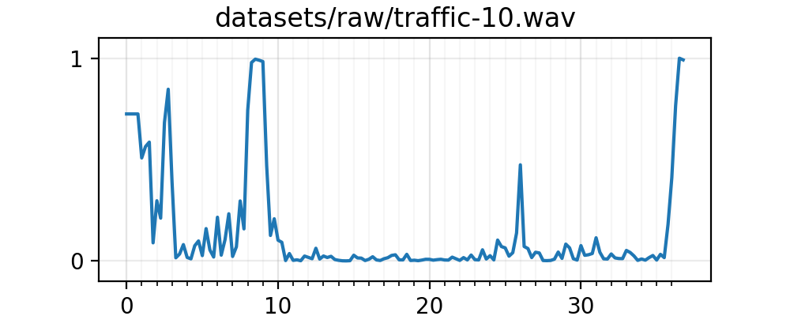

# Identification and Localization of Siren Signals with Beamforming and Non-negative Matrix Factorization

## Team members
- Hankyu Jang (hankjang@iu.edu)
- Leonard Yulianus (lyulianu@iu.edu)
- Sunwoo Kim (kimsunw@iu.edu)

# Part1: Ambulance Identification
## Datasets
### Preprocessing
Convert audio signal to 16kHz sampling rate and 1 audio channel:
```bash
sox --norm <input> -b 16 <output> rate 16000 channels 1 dither -s
```

## Experiment
### Prerequisite
Since the code are written in Python 3, if you run the code on the campus servers, turn Python 3 module on by running:
```bash
module load python/3.6.0
```

### Dimensionality Reduction Model
First, we need to train a dimensionality reduction model (NMF), run the following command to train the model:
```bash
python train-dimred.py <model output> <audio training input>
```

For example, we are building the model using our training ambulance signals:
```bash
python train-dimred.py ambulance.dimred datasets/train/ambulance/*.wav
```

### Classifier (SVM)
We train the classifier using the lower dimensional data that will be transformed by our dimensionality reduction model, run the following command:
```bash
python train-svm.py <classifier model output> <audio training input> --dimred <dimensionality reduction model>
```

```bash
python train-svm.py svm.model datasets/train/**/*.wav --dimred ambulance.dimred
```

### Testing
Now we can use the classifier model to test our test set:
```bash
python test.py svm.model datasets/test/**/*.wav
```

### Result
```bash
$ python train-dimred.py ambulance.dimred datasets/train/ambulance/*.wav
$ python train-svm.py svm.model datasets/train/{ambulance,others}/*.wav --dimred ambulance.dimred
Training accuracy: 0.9746621621621622
$ python test.py svm.model datasets/test/{ambulance,others}/*.wav
Testing accuracy: 0.96
```

### Result (on mixed ambulance data)
```bash
$ python train-dimred.py ambulance.dimred datasets/train/ambulance/*.wav
$ python train-svm.py svm.model datasets/train/{ambulance,others}/*.wav --dimred ambulance.dimred
Training accuracy: 0.9746621621621622
$ python test.py svm.model datasets/test/mixed_ambulance/**/*.wav
Testing accuracy: 0.89
```

## Visualizing audio signals
We can run the detection against longer audio signals, and see the detection per seconds by running:
```bash
python viz-audio.py <classifier model> <audio signal(s)>
```

For example (show graph to the screen):
```bash
python viz-audio.py svm.model datasets/{raw/ambulance1.wav,raw/traffic-10.wav,raw_ambulance_mixed/mixed_ambulance10.wav}
```

For example (save graph to file, useful when running from server):
```bash
python viz-audio.py svm.model datasets/{raw/ambulance1.wav,raw/traffic-10.wav,raw_ambulance_mixed/mixed_ambulance10.wav} --save
```

### Some plot results




# Part2: Localization

Here, we are going to find the location of the ambulance by using the recording data captured from three microphones.

## Mathematic proof of the model

Following diagram shows the overall structure of the problem we are solving.

- <a href="https://www.codecogs.com/eqnedit.php?latex=\textcircled{1}" target="_blank"></a>: microphone1
- <a href="https://www.codecogs.com/eqnedit.php?latex=\textcircled{2}" target="_blank"></a>: microphone2
- <a href="https://www.codecogs.com/eqnedit.php?latex=\textcircled{3}" target="_blank"></a>: microphone3
- <a href="https://www.codecogs.com/eqnedit.php?latex=\textcircled{A}" target="_blank"></a>: ambulance
- <a href="https://www.codecogs.com/eqnedit.php?latex=d_1" target="_blank"></a>: distance from (A) to (1)
- <a href="https://www.codecogs.com/eqnedit.php?latex=d_1" target="_blank"></a>: distance from (A) to (2)
- <a href="https://www.codecogs.com/eqnedit.php?latex=d_1" target="_blank"></a>: distance from (A) to (3)
- <a href="https://www.codecogs.com/eqnedit.php?latex=\Delta&space;d_{12}" target="_blank"></a>: <a href="https://www.codecogs.com/eqnedit.php?latex=d_1" target="_blank"></a> - <a href="https://www.codecogs.com/eqnedit.php?latex=d_2" target="_blank"></a>
- <a href="https://www.codecogs.com/eqnedit.php?latex=\Delta&space;d_{23}" target="_blank"></a>: <a href="https://www.codecogs.com/eqnedit.php?latex=d_2" target="_blank"></a> - <a href="https://www.codecogs.com/eqnedit.php?latex=d_3" target="_blank"></a>
- <a href="https://www.codecogs.com/eqnedit.php?latex=\Delta&space;d_{31}" target="_blank"></a>: <a href="https://www.codecogs.com/eqnedit.php?latex=d_3" target="_blank"></a> - <a href="https://www.codecogs.com/eqnedit.php?latex=d_1" target="_blank"></a>

The three imaginary lines are drawn that equally perpendicularly divides the sides. If the ambulance is on the line where <a href="https://www.codecogs.com/eqnedit.php?latex=\Delta&space;d_{12}" target="_blank"></a>=0, then this means Ambulance is within same distance from (1) and (2). If <a href="https://www.codecogs.com/eqnedit.php?latex=\Delta&space;d_{12}" target="_blank"></a> > 0, the ambulance is located on the right hand side. We used this knowledge to calculate the three distances.


- <a href="https://www.codecogs.com/eqnedit.php?latex=R_{12}" target="_blank"></a>: distance between (1) and (2)
- <a href="https://www.codecogs.com/eqnedit.php?latex=R_{23}" target="_blank"></a>: distance between (2) and (3)
- <a href="https://www.codecogs.com/eqnedit.php?latex=R_{31}" target="_blank"></a>: distance between (3) and (1)
- <a href="https://www.codecogs.com/eqnedit.php?latex=\theta_{12}" target="_blank"></a>: <a href="https://www.codecogs.com/eqnedit.php?latex=\angle&space;1A2" target="_blank"></a>
- <a href="https://www.codecogs.com/eqnedit.php?latex=\theta_{23}" target="_blank"></a>: <a href="https://www.codecogs.com/eqnedit.php?latex=\angle&space;2A3" target="_blank"></a>
- <a href="https://www.codecogs.com/eqnedit.php?latex=\theta_{31}" target="_blank"></a>: <a href="https://www.codecogs.com/eqnedit.php?latex=\angle&space;3A1" target="_blank"></a>


Using the three distances each from microphone to the source, I calculated the distance from the circumcenter to the source. Let's call this distance <a href="https://www.codecogs.com/eqnedit.php?latex=d_0" target="_blank"></a> (length of OA in the following diagram).


After getting the <a href="https://www.codecogs.com/eqnedit.php?latex=d_0" target="_blank"></a>, I calculated the angle from the circumcenter to the source (I set the line 12 as the base line). Let's say this angle as <a href="https://www.codecogs.com/eqnedit.php?latex=\theta_0" target="_blank"></a>.


To calculate <a href="https://www.codecogs.com/eqnedit.php?latex=\theta_0" target="_blank"></a>, I used two triangles, <a href="https://www.codecogs.com/eqnedit.php?latex=\triangle_{012}" target="_blank"></a> and <a href="https://www.codecogs.com/eqnedit.php?latex=\triangle_{10A}" target="_blank"></a> to get the angles <a href="https://www.codecogs.com/eqnedit.php?latex=\theta_{012}" target="_blank"></a> and <a href="https://www.codecogs.com/eqnedit.php?latex=\theta_{10A}" target="_blank"></a>. At last I got <a href="https://www.codecogs.com/eqnedit.php?latex=\theta_0" target="_blank"></a> by subtracting those two angles from 180.

## Implementation of the model

input:
- <a href="https://www.codecogs.com/eqnedit.php?latex=d_{12}" target="_blank"></a>: distance difference of the signal 1 and 2
- <a href="https://www.codecogs.com/eqnedit.php?latex=d_{31}" target="_blank"></a>: distance difference of the signal 3 and 1
- <a href="https://www.codecogs.com/eqnedit.php?latex=R_{12}" target="_blank"></a>: distance between microphone1 and microphone2
- <a href="https://www.codecogs.com/eqnedit.php?latex=R_{23}" target="_blank"></a>: distance between microphone2 and microphone3
- <a href="https://www.codecogs.com/eqnedit.php?latex=R_{31}" target="_blank"></a>: distance between microphone3 and microphone1

output:
- <a href="https://www.codecogs.com/eqnedit.php?latex=d_0" target="_blank"></a>: distance from the circumcenter of the three microphone and the source
- <a href="https://www.codecogs.com/eqnedit.php?latex=\theta_0" target="_blank"></a>: angle from the circumcenter of the three microphone and the source

```bash
$ python -i localization.py -d12 5.0 -d31 4.0 -R12 10.0 -R23 9.7 -R31 10.2
d0: 9.039, theta0: 64.145degrees
```

## Experiment

Shift the wav
```
python shift_wav.py -i 440Hz.wav -o 440Hz_88shift.wav -n 88
python shift_wav.py -i 440Hz.wav -o 440Hz_89shift.wav -n 89
```

This bash script creates shifted waves from 1 to 89
```
shift_wav.sh
```

Equilateral triangle with length of edge: 0.8

If the ambulance is coming from the back straight from the car, the maximum <a href="https://www.codecogs.com/eqnedit.php?latex=\Delta&space;d_{31}" target="_blank"></a> = 0.8 * <a href="https://www.codecogs.com/eqnedit.php?latex=\sqrt{3}" target="_blank"></a> / 2 = 0.69282

0.6922m (89 * sound of speed / sampling rate): this is the maximum <a href="https://www.codecogs.com/eqnedit.php?latex=\Delta&space;d_{31}" target="_blank"></a>.

Ambulance coming reaching the car from the back
```
python localization.py -i1 beep/440Hz.wav -i2 beep/440Hz.wav -i3 beep/440Hz_89shift.wav -R12 0.8 -R23 0.8 -R31 0.8
python localization.py -i1 beep/440Hz.wav -i2 beep/440Hz.wav -i3 beep/440Hz_88shift.wav -R12 0.8 -R23 0.8 -R31 0.8
python localization.py -i1 beep/440Hz.wav -i2 beep/440Hz.wav -i3 beep/440Hz_87shift.wav -R12 0.8 -R23 0.8 -R31 0.8
python localization.py -i1 beep/440Hz.wav -i2 beep/440Hz.wav -i3 beep/440Hz_86shift.wav -R12 0.8 -R23 0.8 -R31 0.8
```
